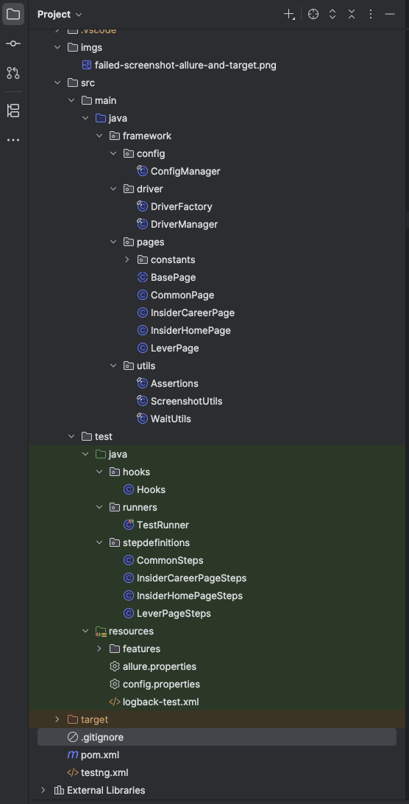
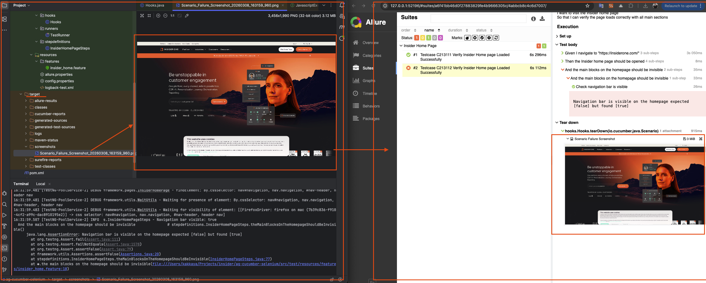
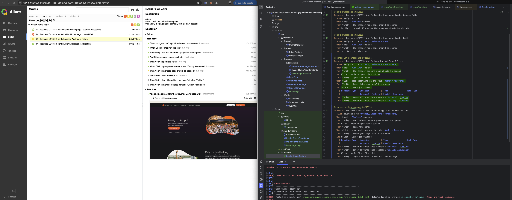

# Insider UI Automation Framework

This project is a robust, scalable, and maintainable UI automation framework built using **Java**, **Selenium WebDriver**, **Cucumber (BDD)**, and **TestNG**. It is designed with modern software engineering principles like **SOLID** and uses the **Page Object Model (POM)** architectural pattern.

---

## Project Structure
The framework follows a clean and modular structure to separate concerns between business logic, page interactions, and low-level framework configuration.



### Key Modules:
- **`src/main/java/framework`**: Core framework components including Driver Management, Configuration, and Utilities.
- **`src/main/java/framework/pages`**: Page Object classes containing locators and actions for each page.
- **`src/test/java/stepdefinitions`**: Step definition classes that map Gherkin steps to code execution.
- **`src/test/java/hooks`**: Cucumber lifecycle hooks (Setup, Teardown, Screenshot on failure).
- **`src/test/resources/features`**: BDD feature files written in Gherkin.

---

## Key Features

### Parallel Execution
The framework supports parallel execution of scenarios to reduce total execution time significantly.
- 
- Managed via `testng.xml` using `data-provider-thread-count`.
- Driver instances are thread-safe using `ThreadLocal<WebDriver>`.

### Cross-Browser Support
Automate tests across multiple browsers with a single configuration change.
- **Supported Browsers:** Chrome, Firefox, Edge, and Safari.
- Handled by `DriverFactory` using `WebDriverManager` for automatic binary setup.
- Configurable via `config.properties` or Maven CLI commands.

### Screenshot & Failure Handling & Allure Report
- Automatic screenshot capture on scenario failure.
- Screenshots are automatically attached to the **Allure Report**.
- Integrated with Cucumber `Hooks` to ensure no failure goes undocumented.



---

## Architecture & Principles

### Page Object Model (POM)
Every web page is represented by a Java class. This ensures:
- **Reusability:** UI actions can be reused across different tests.
- **Maintainability:** If a locator changes, you only need to update it in one place.

### SOLID Principles in Action
- **S (Single Responsibility):** Page classes only handle UI interactions, Step Definitions manage the flow, and Driver classes handle browser lifecycle.
- **O (Open/Closed):** The `DriverFactory` is open for extending new browsers but closed for modification of existing logic.
- **L (Liskov Substitution):** All page classes inherit from `BasePage`, ensuring consistent behavior.
- **I (Interface Segregation):** Specialized utility classes (e.g., `WaitUtils`, `ScreenshotUtils`) provide only relevant methods.
- **D (Dependency Inversion):** High-level modules depend on abstractions (like `WebDriver` interface) rather than concrete implementations.

---

## Reporting
The framework uses **Allure Report** to generate high-quality, interactive test execution reports.



### Generating Reports:
1. Run tests: `mvn clean test`
2. Generate Allure report: `allure serve allure-results`

---

## Getting Started

### Prerequisites:
- Java 17+
- Maven 3.6+
- Allure CLI (optional for report viewing)

### Running Tests:
Run all tests:
```bash
mvn clean test
```

Run on a specific browser:
```bash
mvn clean test -Dbrowser=firefox
```

Run with custom parallel thread count:
```bash
mvn clean test -Dthread.count=4
```

Run test with tag:
```bash
mvn clean test -Dtag="@smoke"
```

Serve allure report:
```bash
allure serve target/allure-results
```
Generate allure report:
```bash
allure generate target/allure-results -o target/allure-report
allure open target/allure-report
```

---

##  Tech Stack
- **Language:** Java
- **Automation:** Selenium WebDriver
- **Test Runner:** TestNG & Cucumber
- **Reporting:** Allure Report
- **Logs:** SLF4J & Logback
- **Build Tool:** Maven